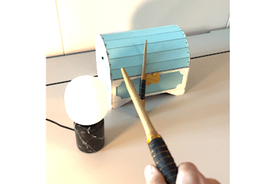

# Wireless Wizard Wand 🪄✨

Bring magic to your home with Nordic Semiconductor Wireless Wizard Wand (www). The wand utilizes a powerful nRF52840 chip with [Edge Impulse ML motion recognition](https://studio.edgeimpulse.com/public/181284/latest) to communicate with all your smart home appliances over Zigbee. 

## Build & deployment

There are currently two options to deploy the project:
1. Use the prebuilt release
2. Build the project using west and nRF Connect SDK v2.3

To flash the hex-file to the Adafruit Feather nRF52840 you can use an external debugger (Segger J-Link or nRF52dk).
The blue indication LED (which indicates Zigbee stack initialization) on the wand should give you a sign whether you have flashed the MCU successfully.
Once the program is running, you can connect to the wand with a micro-USB cable. If the wand detects a serial connection over USB on boot, logging should automatically start. 
The sample application is a simple program that looks for a Zigbee light bulb and sends commands over Zigbee based on ML motion recognition. Once a light bulb is detected, the
red indication LED should light up.

***Demo Spells 🪄✨***
See the [project on Edge Impulse Studio ](https://studio.edgeimpulse.com/public/181284/latest)for more information on the demo ML classifier. 

- 🔁 + 🐇 : Fast Circle => Light On
- 🔁 + 🐢 : Calm Circle => Dimm Up
- ↔️ + 🐇 : Fast Wiper  => Light Off
- ↔️ + 🐢 : Calm Wiper  => Dimm Down
- * : Idle              => Do nothing
 
***Conditions for a working sample***:

✅ Correctly flashed MCU

✅ MPU6050 IMU detected over I2C (see Hardware)

✅ Joined Zigbee network (see [Zigbee Light Bulb Sample](https://developer.nordicsemi.com/nRF_Connect_SDK/doc/latest/nrf/samples/zigbee/network_coordinator/README.html))

✅ Light bulb detected

## About

During my internship at Nordic Semiconductor ASA I was tasked with designing and building a demo that demonstrates the nRF52840's AI capabilities, and thus the Wireless Wizard Wand was born.
The wand was designed and built during the course of my summer internship, and tested during Trondheim Skaperfest (≈maker faire). The test included controlling a light bulb ([IKEA Trådfri](https://www.ikea.com/no/no/p/tradfri-led-paere-e27-470-lumen-smart-kan-dimmes-tradlost-varmhvit-til-kaldhvit-tubeformet-90461916/)) and unlocking a treasure chest
with magic spells. Although not all features were implemented, the demo was a success🥳. 

 

## Hardware & Features

The wand features a 3D-printed Wood-like housing which contains the electronics. The custom PCB which mounts underneath the Adafruit Feather features a 6-axis MPU6050 IMU and DA7280 haptics driver. Both components are connected to the board via I2C. The housing also features a mounting hole for the ERM vibration motor underneath the board. Cost, skill and part availability were all taken into consideration when designing the wand. The custom PCB is designed to be suitable for hand soldering for which the large SMD package sizes allow. 

 

***Main Components***
- [Adafruit Feather nRF52840 Express](https://www.adafruit.com/product/4062#description)
- [Generic MPU6050 Module](https://components101.com/sensors/mpu6050-module)

***PCB***
- Haptic Motor Driver DA7280-00FVC (QFN Package)
- Vybronics ERM Vibration Motor VC1030B028F
- Panasonic SMD Button EVQ-P7J01P
- 0805 Packages for passive components

***Casing***
- ICR18650-22F Battery
- Connection Pins from MPD BH-18650-W
- Smartfil Wood Filament

## How I made it

***Programming and Edge Impulse ML***

The software was developed in VSCodium using [nRF Connect for VSCode](https://marketplace.visualstudio.com/items?itemName=nordic-semiconductor.nrf-connect-extension-pack). The sample application is based on the Zigbee Light Switch sample in nRF Connect SDK. I approached the machine learining module with a mindset of "as simple as possible, but not simpler". Data for the ML model was captured through a simple data forwarder over serial. I decided on five simple labels which I believed would have good enough clustering in the Spectral Feature Filter, and collected <15min training data. I used Edge Impulse Studio to tune a Spectral Feature filter, which showed promising clustering and minimal overlap with 39 output features. Next I built a simple classifier with 39 input features from the spectral feature filter and two dense layers (39 features => 20 neurons => 10 neurons => 5 classes). The classifier was then trained for 100 epochs with a learning rate of 0.0005 to avoid overfitting. The result was a classifier with 99.9% accuracy on test data. During live testing this prooved to be closer to 80% due to overlap between "Calm Circle" and "Calm Wiper", which one could expect. Using Edge Impulse Studio's optimizer I compiled and exported the Edge Impulse module for a Cortex-M4F 64MHz (which the nRF52840 uses). Once exported, the Edge Impulse model could be imported as a C++ library (which Zephyr supports). Furthermore, I implemented mutex logic to safely sample and buffer accelerometer data from the MPU6050 and the Edge Impulse library.  

***PCB Design***

Due to size constraints I decided to design a custom PCB which would house both the IMU and the haptics driver. I first designed the wand to use a BMI270 low-power IMU, but had to change to a different IMU due to its small package size and high price. The MPU6050 Module was chosen due to its price and availability. Using a module instead of an IC was an easy choice since the module was cheaper than all the parts individually (for consumers). I designed the PCB to be easy to assemble, with the IMU soldered with headers underneath the PCB. I used KiCAD for the design, and ordered it through JLCPCB.

 

***Hardware Design***

The 3D-printed housing was designed in FreeCAD. It was designed with the aim of minimizing its size without sacrificing aesthetics. With limited time, this part of the project was given a lower priority. Hardware files including the PCB design are located in the *hardware-files* folder.

 

## Further Development

- Implement Haptics
- Proper IMU Configuration
- LED indication
- Zigbee pairing logic
- Power optimization
- Separate charging circuit to improve charge time
- Fix cable routing tolerance in casing

